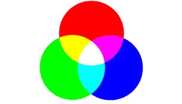
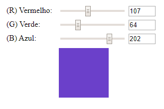

  

### Description
*RGB scale using HTML, CSS and pure JavaScript*

### Requirements
The project is finalized, and to promote changes it is only required:

* [Nodejs](https://nodejs.org/en/)
* [IDE (for project development)](https://code.visualstudio.com/)

### Technologies

* CSS
* HTML
* JavaScript

### Facility
Live-Server is a little development server with live reload capability. Use it for hacking your HTML/JavaScript/CSS files.

To install globally, do:

> npm install -g live-server

* [Mais informações](https://www.npmjs.com/package/live-server)

### Launch

To run the project, you need to start the live-server from the command line

> live-server

### Output

